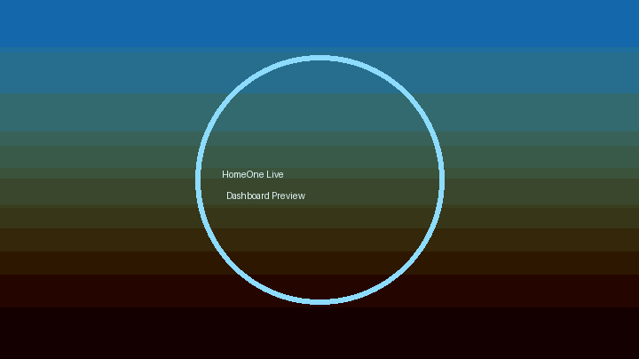

# HomeOne · Smart Home Control System

[](#)
[](#)

> Make your smart home feel like Apple's Home app — just 1000× cooler.



## Features

- **Glassmorphism dashboard** with live device telemetry, animated toggles/sliders, auto dark mode, and mobile-first navigation.
- **Real-time engine** powered by FastAPI + WebSockets broadcasting to every connected client within milliseconds.
- **Zustand orchestration** for instant UI updates, optimistic device commands, and resilient local persistence for offline mode.
- **Aura Voice** control — hold spacebar and say “Turn off lights” or “Set AC to 22” to command the entire home.
- **Eco Mode confetti** celebrating power savings when every controllable device sleeps.
- **PWA ready**: installable, offline-capable, and resumes the last known state even without connectivity.
- **Deploy in one click** to Vercel (frontend) and Railway (backend) with environment-aware defaults.

## Quickstart

```bash
npm install && npm run dev
```

That one-liner boots the FastAPI WebSocket simulator and the Vite + React dashboard concurrently.\
Optional: `pip install -r requirements.txt` to ensure backend dependencies are available globally.

Then open http://localhost:5173 to explore HomeOne.

## Architecture

```text
server.py         FastAPI + WebSocket broadcaster with simulated smart devices
src/              Vite + React + Tailwind UI, Zustand store, hooks, and components
 ├─ store/        Persistent device state + theme + connection status
 ├─ hooks/        WebSocket client, voice recognition, current time helpers
 ├─ components/   Top bar, device cards, nav, voice hint
public/           PWA icons, favicon, manifest assets
.env              VITE_WS_URL=ws://localhost:8000/ws
```

## Device Roster

| Device        | Control Type | Live Telemetry                                      |
|---------------|--------------|----------------------------------------------------|
| Lights        | Slider       | Scene mode, brightness, optimistic toggles         |
| AC            | Slider       | Temperature, humidity, mode swapping               |
| Door Lock     | Lock/Unlock  | Lock state, biometric status                       |
| Camera        | Toggle       | Recording privacy states                           |
| Coffee Maker  | Toggle       | Brew cycles, bean selection, barista narration     |
| Music         | Slider       | Spatial playlists, volume, “now playing” metadata  |

## Built-in Magic

- **Voice Command Grammar**
  - `Turn off lights`, `Turn on camera`, `Unlock the door`, `Set AC to 23`, `Set music to 40`
  - Optimistic updates even before ACK; the server broadcasts confirm the final state.
- **Eco Mode** triggers confetti and a toast whenever all active devices (except the lock) are idle.
- **Offline Awareness** stores last-known values via Zustand persistence and surfaces a banner while reconnecting.
- **PWA Install** via browser prompts (desktop + mobile). Workbox caches keep HomeOne responsive offline.

## Deployment

| Target   | Button |
|----------|--------|
| Frontend | [](https://vercel.com/new/clone?repository-url=https%3A%2F%2Fgithub.com%2FYOUR_GITHUB%2Fhomeone&project-name=homeone-frontend&repository-name=homeone) |
| Backend  | [](https://railway.app/template?referralCode=YOUR_CODE&repo=https%3A%2F%2Fgithub.com%2FYOUR_GITHUB%2Fhomeone) |

Update environment variables (`VITE_WS_URL`) after deployment as needed.

## Scripts

| Command              | Description                                      |
|----------------------|--------------------------------------------------|
| `npm run dev`        | Concurrent dev servers (FastAPI + Vite)          |
| `npm run dev:client` | Vite dev server only                             |
| `npm run dev:server` | Uvicorn reload server (`server.py`)              |
| `npm run build`      | TypeScript project references + Vite production build |
| `npm run lint`       | ESLint across the repo                           |
| `pip install -r requirements.txt` | Install backend dependencies        |

## Environment

```
VITE_WS_URL=ws://localhost:8000/ws
```

Place overrides in `.env` or configure the deploy target accordingly.

## Creator

- Crafted by [YOUR NAME] • [Built with Cursor AI in 7 minutes](https://cursor.com)

Enjoy living in the future with HomeOne. ✨
